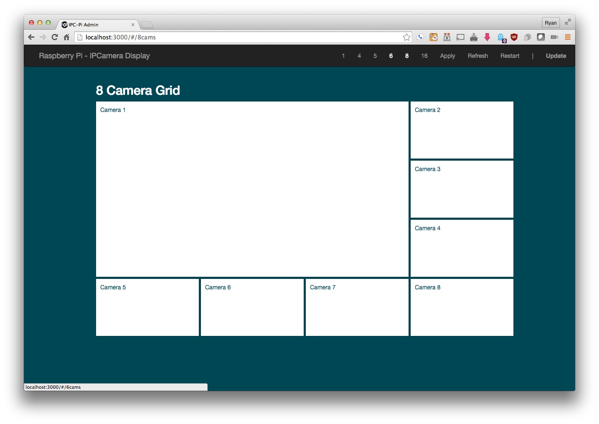
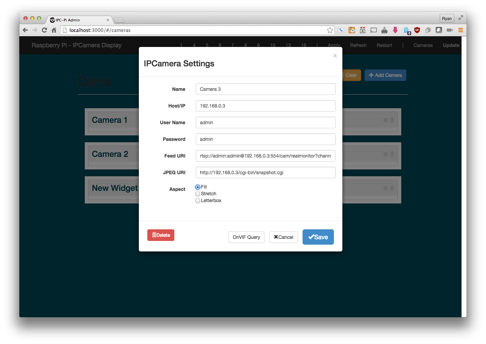

## About

Pronounced: Ras - Pip - See

Goal: easily display security cameras on a dedicated monitor with an easy to use and modern WebUI.

> Under Very Heavy Development

#### Features
* RSTP H264 TCP Video Streaming
* 1/4/5/6/7/8/9/10/13/16 Grid Displays
* WebUI for easy setup
* Stream Watchdog restarts dead streams
* External IO for monitor

## Screenshots
=================

