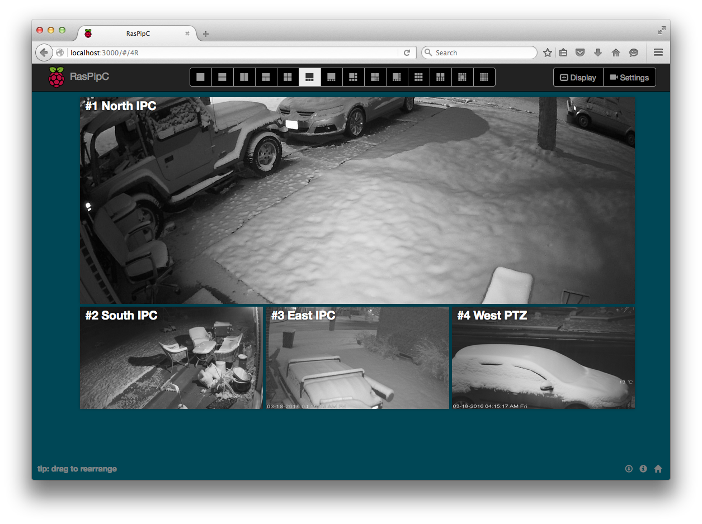
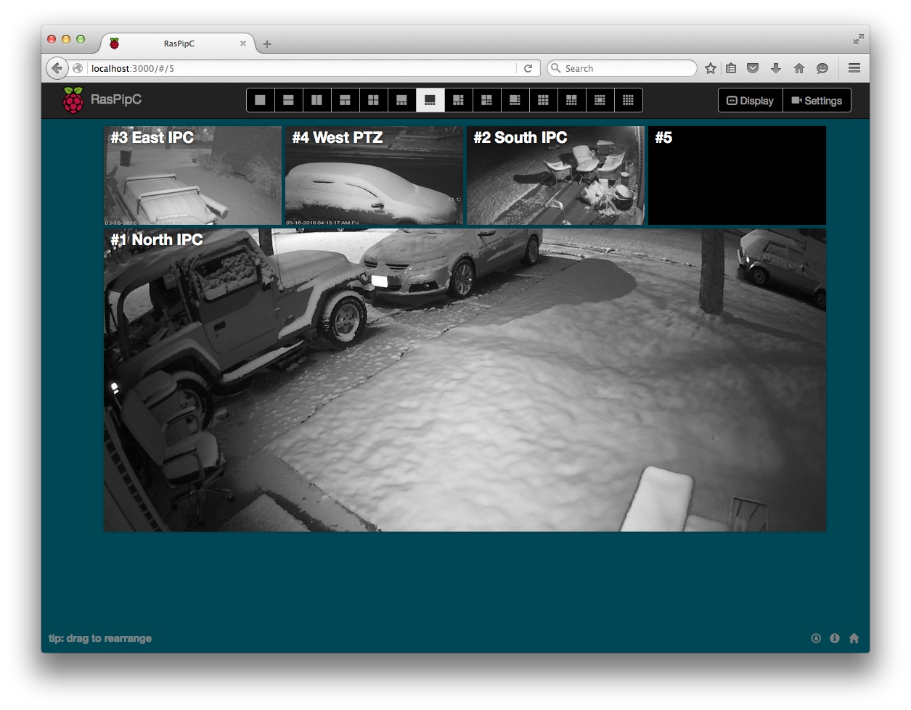
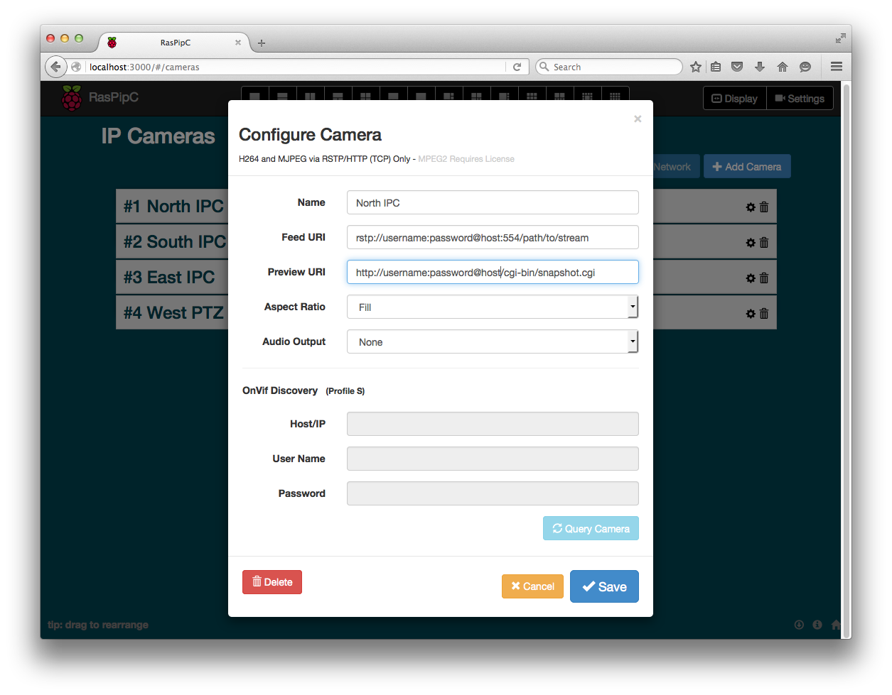
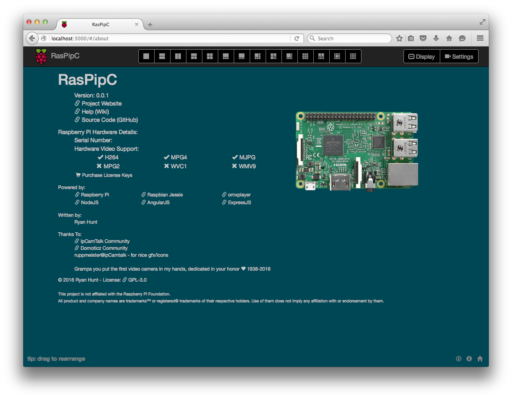

# RASPberry IPCamera TV
## About
Pronounced: Ras - Pip - See - Tee - Vee

Goal: Display security cameras on a TV or dedicated Monitor; all managed remotely with a simple and modern WebUI.

> Under Very Heavy Development - NON FUNCTIONAL

RasPipC.tv is a fancy web interface for omxplayer, the Raspberry Pi command line video player.
Loaded up on a Raspberry Pi, a $35 credit card sized computer, It allows you to quickly and easily get your security cameras video feeds displayed on your Television with many great layouts that you can customize.
In CCTV lingo it is an IP-Feed to HDMI adapter with a nice browser interface.

#### Features (95% Complete)
* RSTP/HTTP H264/MJPEG/MPEG2 (TCP) Video Streaming
* 1-10/13/16 Camera Grid Displays
* Multi-language Support
* Letterbox/Stretch/Fill Aspect Ratios
* WebUI for easy setup
  * Drag and drop arrangement
  * ONViF Detection
  * Preview Image
* Stream Watchdog
  * Restarts dropped streams
  * Durring outage, displays next highest priority
* Raspbian Jessie image - boot and go!

### Requirements:
* Compatible RSTP or HTTP Video streams
  * Note that MPEG2 Decoding requires the purchase of an external license.
* Raspberry Pi2 or newer
* Wired Ethernet for best results
* Monitor connected via HDMI
  * FYI: Aspect Ratios will be identical to your display

### Screenshots

